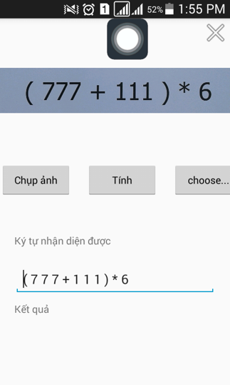
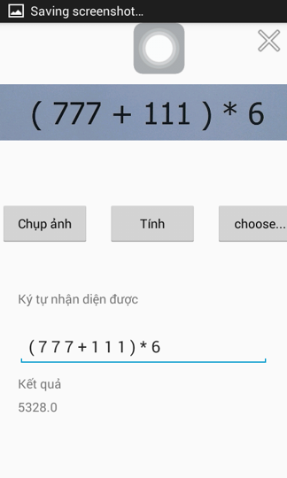

# picture Math: taking pictures of math expressions and calculating their results.

This project was implemented jointly by [AcidHimKoPhim](https://github.com/AcidHimKoPhim) and her colleagues. The project was a course project for the Introduction to Knowledge engineering and  Machine Learning class at the Vietnam National University HCMC, University of Information Technology [UIT](https://en.uit.edu.vn/). Year of conducting the project: 2015.

## Requirement

    gradle 1.3
    compileSdkVersion 23
    minSdkVersion 16
    buildToolsVersion 23.0.2
    opencv
    java
    Android Studio (Jelly Bean)
    Input image are expression (numbers from 0-9 and operators in {+,-,*,/,(,)} with white background).

## Install
    Rebuild the project and check the output `app.apk` in `/app/build/outputs/apk/` and run on Android device.
    
## Results
    
    
    Interface after finishing the expression recognition. Press `Tính toán` for calculating result of the recognized expression.
    
    
    
    The recognition result was not so accurate (depending on font of the expression, camera resolution, light, etc.). I recommend current state-of-the-art CNN models for recognition. 

    
